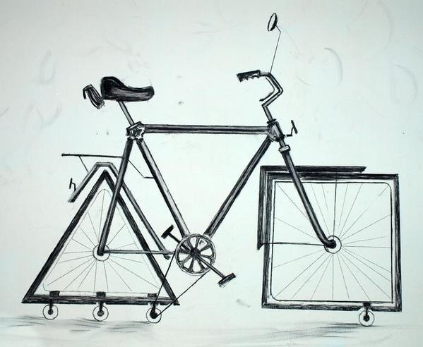

# занятия с группой 1135 в первом семестре 2024

> Если программисты строили бы дом,
> 
> Фундамента могло б не оказаться в нём.
> 
> Четыре стены глухих, двери - потом.
> 
> Окна - тоже, понадобится - пробьем!
> 
> Так, что еще нужно? А, крыша!
> 
> Видишь картон? Бери его, парниша!
> 
> Тащи его наверх, клади его в два слоя,
> 
> Чтоб ветром не срывало, к черту остальное.
> 
> Опять стройка встала, на стройке паралич - Прораб изобретает свой собственный кирпич.
> 
> Пока косится лавэ - всё прорабу трын-трава, Он ходит, напевает эти странные слова
> 
>
> Семь бед - один ответ:
> Костыль и велосипед!
> Семь бед - один ответ:
> Вставь костыль, изобрети велосипед!!!
>
> >[Научно-технический рэп - Костыль и велосипед](https://www.youtube.com/watch?v=wjFgOckkVYM)

## [Уроки -> Задания -> Решения ](/doc/index.md)

Полезные ссылки:

[https://learnxinyminutes.com/docs/ru-ru/php-ru/](https://learnxinyminutes.com/docs/ru-ru/php-ru/)  
[https://www.php.net](https://www.php.net)

Шаблоны Bootstrap 5:

[bootstrapmade.com](https://bootstrapmade.com/bootstrap-5-templates/) 
[themewagon.com](https://themewagon.com/theme-framework/bootstrap-5/?swoof=1&pa_price=free&really_curr_tax=28-pa_frameworks)
